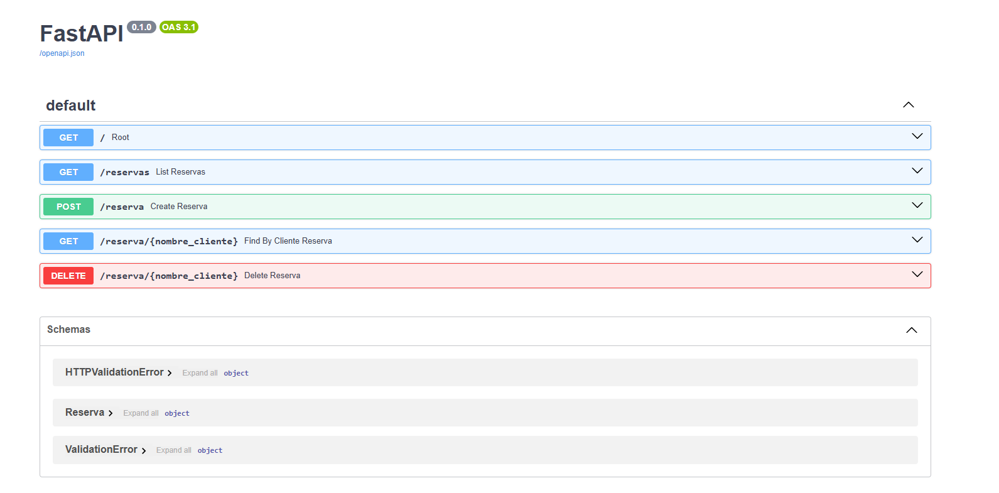
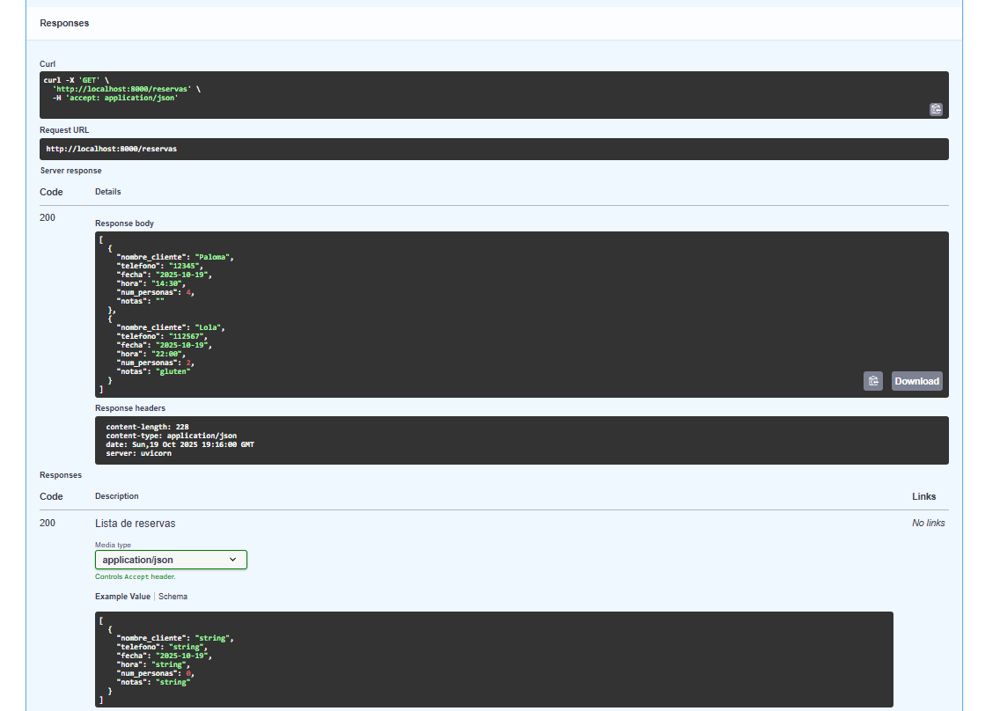
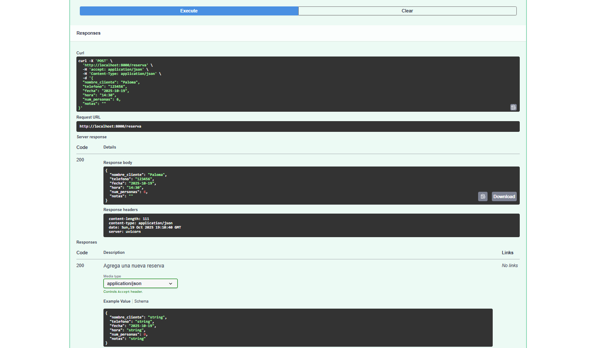
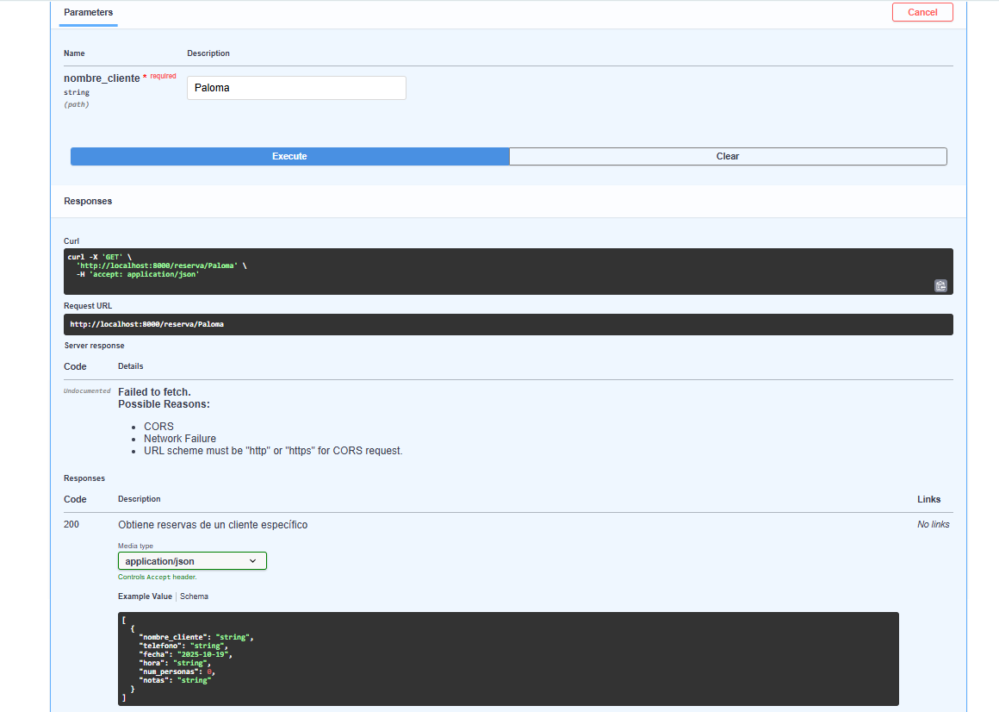
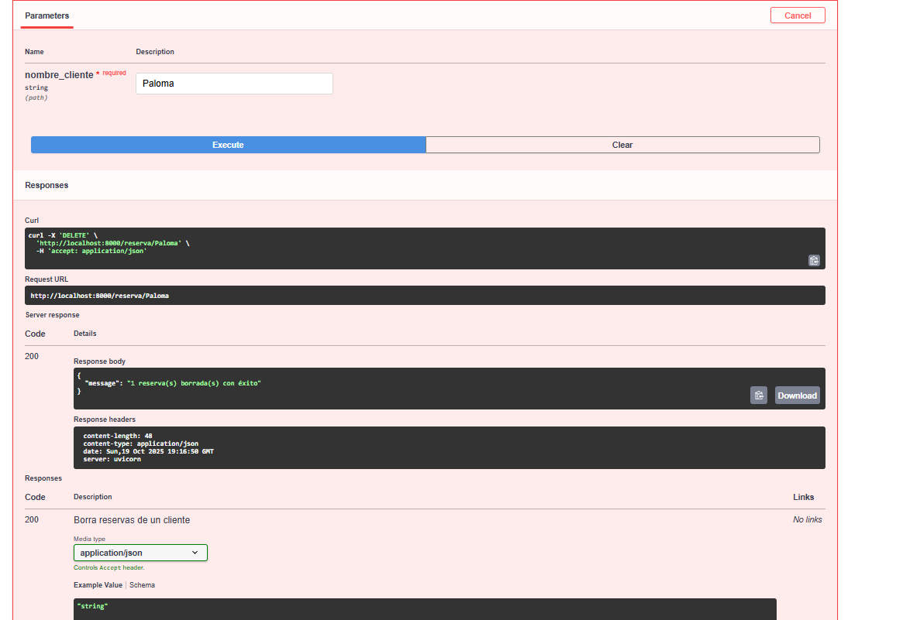
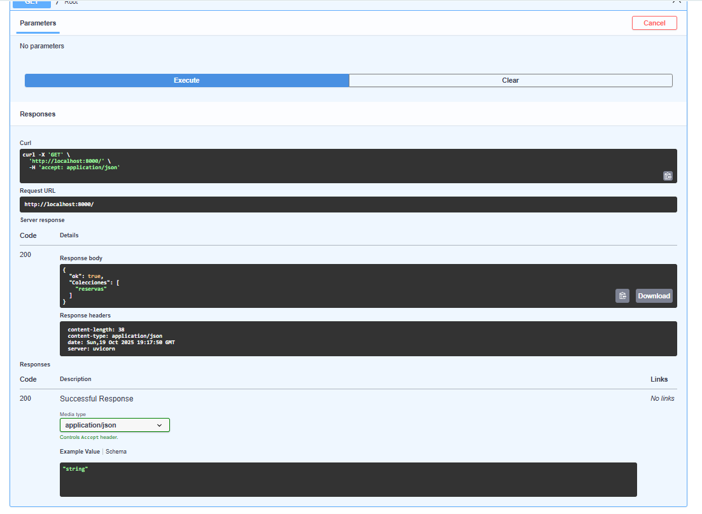

# 🍽️ Restaurant Reservation API

API CRUD para gestión de reservas de restaurante desarrollada con **FastAPI** y **MongoDB**.

## 📋 Descripción

API que implementa operaciones básicas CRUD (Create, Read, Update, Delete) para la gestión de reservas de restaurante. Desarrollada como ejercicio con FastAPI y MongoDB.

## 🚀 Características

- **Listado** de reservas
- **Alta** de nuevas reservas  
- **Baja** de reservas existentes
- **Endpoint adicional** para búsqueda por cliente
- **Documentación automática** con Swagger UI
- **Base de datos NoSQL** con MongoDB

## 🛠️ Tecnologías Utilizadas

- **FastAPI** - Framework web moderno y rápido
- **MongoDB** - Base de datos NoSQL
- **Motor** - Driver asíncrono para MongoDB
- **Pydantic** - Validación de datos
- **Docker** - Containerización
- **Mongo Express** - Interfaz web para MongoDB

### Funcionalidades Principales

### FastAPI

#### 1. Listado de Reservas
Endpoint: `GET /reservas`

#### 2. Crear Nueva Reserva
Endpoint: `POST /reserva`

#### 3. Buscar Reservas por Cliente
Endpoint: `GET /reserva/{nombre_cliente}`

#### 4. Eliminar Reservas
Endpoint: `DELETE /reserva/{nombre_cliente}`

#### 5. Estado de la API
Endpoint: `GET /`

